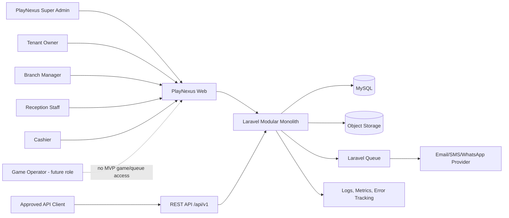
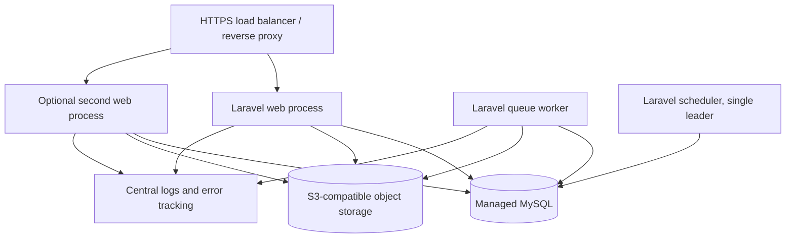
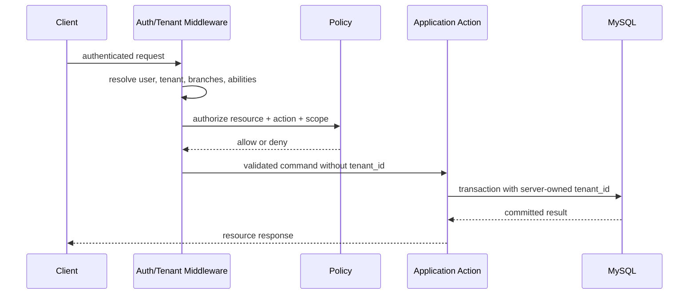
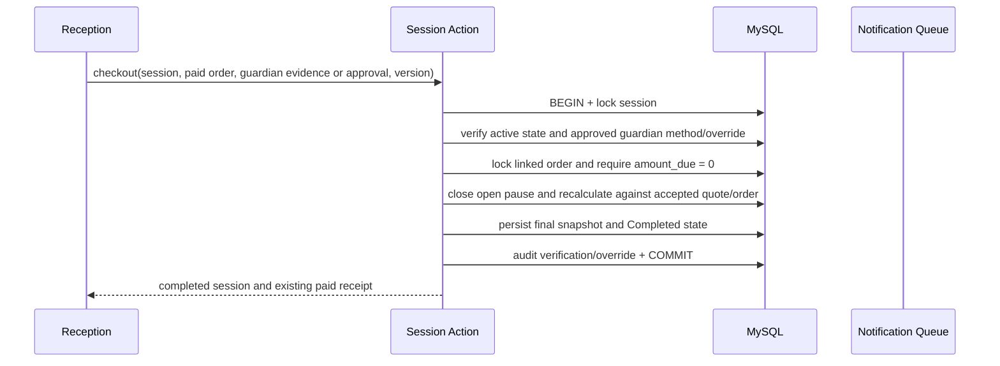
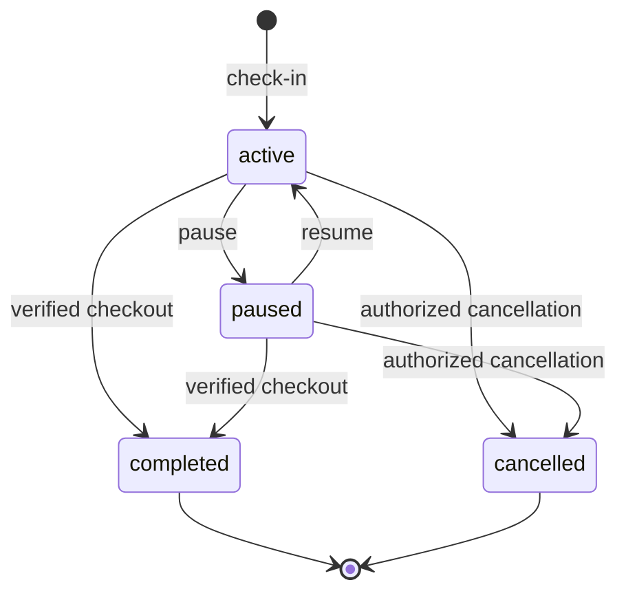

# PlayNexus Architecture Document

## T14 bounded owner-read implementation

For `/app/tenant` only, explicit tenant_owners membership grants a tenant-global read boundary without a branch assignment. Branch operational routes continue to require active assignments and BranchPolicy; the tenant-global read exception does not grant branch operations or resolve future owner-wide branch selection. Generic RBAC and platform identity remain later work.

**Document ID:** PN-ARC-001  
**Status:** Draft implementation baseline pending product, safety, finance, and technical approval  
**Scope:** Phase 1 MVP  
**Source:** PlayNexus PRD v1.0, June 2026  
**Audience:** Product, engineering, QA, operations, and security

## 1. Executive decision

Build PlayNexus as a Laravel modular monolith with a server-rendered web application, a versioned REST API, and one MySQL database. Use Blade for ordinary pages and Livewire only for high-interaction operational screens such as check-in, active sessions, and POS. Use Laravel session authentication for the web application and Laravel Sanctum for API tokens.

All tenant-owned rows carry a mandatory `tenant_id`. Tenant context comes from the authenticated identity, never from an untrusted request parameter. Laravel middleware, query scopes, policies, validation, database constraints, and tests enforce isolation together. No tenancy package, microservices, event broker, search engine, or separate reporting database is required for the MVP.

This design is the shortest safe path to a pilot: one deployable application, one transactional boundary, familiar Laravel conventions, and explicit seams that can be extracted only after measured load or team boundaries justify it.

## 2. Scope and traceability

### 2.1 MVP capabilities

| Capability | PRD trace | Architecture module |
|---|---|---|
| Tenant and subscription administration | FR-001 | Platform & Tenancy |
| Branch configuration and branch access | FR-002, BR-009 | Branch Operations |
| Staff roles and permissions | FR-003, BR-004 | Identity & Access |
| Guardian and child registration | FR-004, BR-001 | Customer Registry |
| Check-in, pause, resume, checkout, cancellation | FR-005, BR-002–BR-005 | Sessions |
| Pricing, duration, pause, extension, final charge | FR-006 | Pricing & Time Engine |
| Ticket issue, QR/barcode, scan, cancellation | FR-007 | Ticketing |
| Ticket/product/add-on sales | FR-008 | POS |
| Payments, refunds, and receipts | FR-009, BR-006–BR-007 | POS & Payments |
| Revenue, attendance, session, and staff reports | FR-010 | Reporting |
| Ending alerts and digital receipts | MVP scope | Notifications |
| Basic incident records | Section 8.12; OQ-20 | Safety — conditional; do not release unless OQ-20 adds it to MVP |

### 2.2 Deliberately deferred

Memberships, loyalty, wallet, birthdays, advanced inventory, HR, cashier-shift/cash-drawer management, games/queues/slots/participation, native apps, marketplace, white-label, franchise features, AI, online payment gateways, marketing/campaign sending, and external accounting integrations remain outside the MVP. They must not add tables, routes, permissions, migrations, packages, or background services until their phase is approved. Basic incident recording/search is conditional on OQ-20 because the PRD describes it in the Safety module but omits it from the explicit MVP inventory.

### 2.3 Assumptions requiring product confirmation

- **Working assumption for OQ-01:** the MVP records in-person payments; it does not process online payments.
- **Working assumption for OQ-02:** QR/barcode scanners behave as keyboard input; proprietary wristband drivers are not required.
- **Working assumption for OQ-03:** the product stays online during operations. Offline mode is a separate product capability, not a transparent implementation detail.
- English and Arabic are supported at the UI/content layer; persisted operational timestamps remain UTC.
- **Proposed model pending OQ-06:** each branch operates in one configured currency, and a tenant-wide accounting currency may additionally be retained for reporting. Do not enforce equality between tenant and branch currency until launch-market and finance policy is approved. Branches may have distinct time zones and tax settings.

## 3. Quality goals

1. **Safety and correctness:** a child is checked out only after guardian verification or an authorized, audited override.
2. **Tenant isolation:** no tenant principal can read, infer, change, or export another tenant's data.
3. **Financial integrity:** totals are snapshotted, operations are atomic, and payments/refunds are never silently edited.
4. **Operational speed:** ordinary commands complete within two seconds under normal pilot load; standard dashboards within five seconds.
5. **Recoverability:** failures leave a committed previous state or a fully committed new state, never a partial transaction.
6. **Maintainability:** use Laravel-native controllers/actions, form requests, Eloquent models, policies, jobs, events, and migrations before custom infrastructure.

## 4. System context



External message providers are adapters behind one notification interface. The MVP may start with email and one regional SMS/WhatsApp provider after commercial approval. Provider callbacks are not a dependency for check-in, checkout, or payment recording.

## 5. Runtime and deployment view



### 5.1 Minimum production processes

| Process | Responsibility | Scaling rule |
|---|---|---|
| Web | Web routes and `/api/v1` | Add stateless instances when latency or CPU requires it |
| Queue worker | Notification delivery and retryable side effects | Add workers when oldest-job age breaches the alert threshold |
| Scheduler | Ending-alert scan, housekeeping, retention jobs | Exactly one scheduler leader |
| MySQL | System of record and transactional concurrency | Managed primary with automated backups |

Use the database session, cache, and queue drivers initially so multiple web nodes share state without another service. Move cache/queue to Redis only when queue latency, database load, or concurrency measurements justify it. Correctness must never depend on a cache entry.

### 5.2 Storage

- Store child photos and generated receipt artifacts in private object storage.
- Persist only opaque object keys in MySQL; issue short-lived signed URLs after authorization.
- Do not store uploaded files on local application disks.
- Validate media type, size, and image decoding; strip metadata from child photos.

## 6. Application structure

Keep one Laravel application and organize business code by module. Each module owns its models, policies, form requests, actions, domain events, jobs, and tests. Cross-module calls use application actions or immutable data objects; do not create interfaces with one implementation.

```text
app/
  Modules/
    Platform/
    Identity/
    Branches/
    Customers/
    Pricing/
    Sessions/
    Ticketing/
    Pos/
    Safety/
    Notifications/
    Reporting/
    Audit/
  Http/
    Middleware/
    Controllers/Web/
    Controllers/Api/V1/
    Requests/
  Support/
resources/views/
routes/web.php
routes/api.php
```

The folder names are boundaries for ownership, not independently deployable components. A module may use another module's public action; it must not update another module's tables through ad-hoc queries.

### 6.1 Module responsibilities

| Module | Owns | Publishes/consumes |
|---|---|---|
| Platform | Plans, tenants, subscriptions, platform status | Tenant activated/suspended |
| Identity | Users, roles, permissions, branch assignments, API tokens | Authorization decisions |
| Branches | Branch settings, hours, capacity | Branch availability |
| Customers | Guardians, children, relationships, consent | Child/guardian lookup |
| Pricing | Pricing rules and billing calculator | Deterministic quote result |
| Sessions | Session state, pauses, adjustments, checkout verification | Session events |
| Ticketing | Ticket types, tickets, scans | Ticket validated/consumed |
| POS | Products, orders, one full payment, full refunds, receipts | Sale paid/refunded |
| Safety | Conditional basic incidents and append-only follow-up | Incident events; module disabled unless OQ-20 is approved |
| Notifications | Allowlisted operational templates, delivery jobs, attempt logs | Consumes session-ending and receipt events |
| Reporting | Read queries and exports | Reads committed operational data |
| Audit | Immutable security/business audit records | Consumes explicit audit entries |

## 7. Web and API boundaries

### 7.1 Web UI

- Blade layouts and components handle navigation, tables, forms, empty/error states, and receipts.
- Livewire is limited to workflows where server-driven state reduces page transitions: guardian search/registration, check-in, active-session timers, checkout quote, and POS cart.
- The displayed timer is advisory. Server UTC timestamps and the pricing engine are authoritative.
- Every command uses a form request, policy check, application action, and post-commit UI feedback.
- Web routes use secure, HTTP-only, same-site cookies, session regeneration on login, CSRF protection, and rate-limited authentication.

### 7.2 REST API

- `/api/v1` uses JSON and Laravel Sanctum bearer tokens for approved clients.
- Tokens are bound to a user, tenant, allowed branches, and abilities. Token values are shown once and stored hashed.
- Operational browser traffic does not need to call the public API; it can use session-authenticated web actions.
- API details and examples are defined in `09-API-Specification.md`; the machine-readable contract is `contracts/openapi.yaml`.

## 8. Tenant isolation

### 8.1 Tenant resolution

1. Authentication resolves a platform user or a tenant user.
2. `ResolveTenantContext` obtains `tenant_id` from the authenticated user/token.
3. A normal tenant client cannot select tenant context with a header, route value, query parameter, or request body.
4. Platform routes live under a separate `/platform` authorization boundary. A Super Admin uses an explicit, audited support-access workflow before viewing tenant operational data.
5. Branch access is the intersection of tenant context and active `user_branch_assignments`.

### 8.2 Enforcement layers

- `tenant_id` is non-null on every tenant-owned table.
- A `BelongsToTenant` model trait adds the current tenant filter and rejects creation without context. A CLI job must explicitly establish tenant context before querying tenant models.
- Policies verify tenant and branch scope for every read and command; controllers never rely on hidden buttons for authorization.
- Form requests ignore client-supplied `tenant_id`; actions assign it from context.
- Composite unique keys and composite foreign keys include `tenant_id` where they prevent cross-tenant references.
- Queue payloads carry scalar tenant and entity IDs. Middleware restores tenant context before deserializing/using tenant models.
- Report queries and exports use the same scoped repositories/policies.
- Feature and integration tests create two tenants and prove cross-tenant IDs return `404`, not `403`, to avoid resource enumeration.

MySQL has no application-independent row-level security equivalent for this design. Application scoping plus database constraints are therefore release-blocking controls, not optional conventions.

## 9. Authentication and authorization

### 9.1 Identities

- Super Admin is a platform-scoped staff identity and has no tenant membership by default.
- Tenant staff have one tenant and zero or more branch assignments.
- A Tenant Owner has tenant-wide scope.
- Parent/Guardian self-service authentication is deferred; guardian records are customer data, not staff user accounts in the MVP.

### 9.2 Authorization sequence



Permissions are deny-by-default. Role permission names and approval rules are specified in `08-Permission-Matrix.md`. High-risk actions require both an ability and, where applicable, an approved one-time `approval_record`.

## 10. Core transactional flows

### 10.1 Check-in

Execute one MySQL transaction:

1. Lock the child row and verify it belongs to the current tenant.
2. Verify the branch is active and assigned to the actor. Apply no hard/override capacity behavior until OQ-11 is approved; branch capacity may be displayed as information in the interim.
3. Verify the child has at least one active guardian relationship.
4. Reject if an active/paused session already exists for the child.
5. Lock and validate the ticket, or snapshot the selected pricing rule.
6. Create the session, ticket association, and initial session event.
7. Mark a single-use ticket `consumed` when its policy requires consumption at check-in.
8. Write the audit record and commit.

Return the committed server timestamp and charge preview. Idempotent replay returns the same session.

### 10.2 Pause/resume

Lock the session row. Verify its current state and `lock_version`. A pause creates an open `session_pause`; a resume closes the one open pause. Update session status/version and append an immutable session event in the same transaction. Only pause types configured to exclude time reduce billable duration.

### 10.3 Checkout and guardian verification



The pricing calculation is a pure deterministic service that accepts timestamps, pause intervals, extensions, pricing snapshots, rounding rules, and adjustments. Persist its inputs and outputs on checkout; never recompute historical receipts from a later pricing rule. A session cannot become `completed` while its required linked order has an amount due; no unpaid exception is implemented unless separately approved.

**Open decision OQ-19 — station/payment handoff:** Product and Operations must decide whether Reception performs quote, payment, and completion at one station or hands a draft order to Cashier before Reception completes release. The architecture does not assign that ownership. The contract intentionally keeps quote/order creation, payment posting, and final session completion as separately idempotent, recoverable commands so either approved station model can use the same invariants. Paid-but-not-completed remains visible and retryable; payment is never silently rolled back because a later guardian-verification/completion command fails.

**Open decision OQ-12 — guardian verification:** `relationship`, `code`, phone/photo/manual checks, and other candidate methods are not approved enum values yet. The checkout command accepts only the allowlist selected by Safety/Legal; manager override remains separately permissioned and audited.

### 10.4 POS payment

Under planning assumptions ASM-08/ASM-10 pending OQ-09, lock the draft order within one transaction, recalculate line totals from immutable price snapshots, validate discount approval, require one payment for the full amount due, create an append-only posted payment, mark the order paid, allocate the receipt number, and audit. The API never accepts client-calculated totals as authoritative. Split/partial payments and cashier shifts are not exposed by this draft baseline; an OQ-09/OQ-24 decision can change that only through synchronized requirements/schema/API/test updates.

### 10.5 Refund

Refunds do not edit or delete payments. The ASM-10 planning baseline pending OQ-09 supports one full reversal only: a permitted actor requests a full refund with reason; an authorized manager/owner approves it; execution locks the paid order/payment, rejects any prior refund, derives the entire posted amount server-side, creates one append-only posted refund, and marks the order refunded in one transaction. Partial refunds are not exposed by this draft contract. A provider call, if added later, occurs through an idempotent job and stores external references.

## 11. State models and invariants

### 11.1 Session



- Completed and cancelled sessions are immutable.
- Corrections use `session_adjustments`, never direct edits.
- Reopening a completed session is not an MVP operation.
- One session may have at most one open pause.

### 11.2 Ticket

`draft → issued → consumed`; `issued → cancelled`; `issued → expired` by scheduled maintenance or read-time evaluation. `consumed`, `cancelled`, and `expired` are terminal for MVP purposes. Reprint is an audited event, not a state change. Every scan creates `ticket_scans`, including rejected scans.

### 11.3 Order and payment

Under ASM-08/ASM-10 pending OQ-09, order states are `draft`, `paid`, `refunded`, `voided`. A draft order receives exactly one full posted payment and becomes paid; a paid order receives at most one full posted refund and becomes refunded. Split/partial payment and partial refund are not represented by this draft state's request fields.

## 12. Pricing and money

- Store money as signed `BIGINT` minor units plus ISO 4217 currency code; never use binary floating point.
- Store tax/discount rates as integer basis points (`10000 = 100%`).
- Snapshot product/ticket description, unit price, tax rate, and pricing-rule inputs on the order/session.
- The pricing engine calculates elapsed seconds from UTC timestamps, subtracts eligible pauses, applies base duration/price, rounds chargeable overtime by the configured rule, and adds approved adjustments.
- The server produces a quote with calculation lines. Checkout locks the session and recalculates before persisting to prevent stale totals.
- All rounding occurs once at line level according to the branch's documented tax mode; order totals are sums of stored line totals.

## 13. Asynchronous work

Only non-critical side effects use the queue:

- send session-ending alerts;
- send receipts;
- retry provider delivery;
- generate large exports if a later release enables them;
- perform retention/anonymization jobs.

Check-in, state transitions, pricing, checkout, payment recording, refund recording, and audit writes remain synchronous database transactions. Dispatch jobs after commit. Each job uses a stable business key and is safe to retry. Provider outages must not roll back an operational transaction.

The scheduler finds sessions whose next alert is due in bounded tenant/branch batches and enqueues one notification per unique `(session_id, alert_type, due_at)` key. Canonical message states are `queued`, `sending`, `sent`, `delivered`, `failed_retryable`, `failed_permanent`, and `stale`. Only retryable failures return to `queued`, with bounded backoff; an obsolete session alert becomes `stale`; `sent` is never presented as `delivered` without an authenticated provider callback. Staff may resend eligible permanent/retry-exhausted operational messages from the log. Marketing templates/jobs are not seeded or callable in MVP.

## 14. Reporting

Use indexed read queries against the primary database for MVP revenue, attendance, sessions, and staff activity reports. Reports:

- require tenant scope and authorized branch filters;
- use half-open UTC ranges derived from the requested branch-local dates;
- reconcile revenue from paid orders, payments, and refunds rather than audit logs;
- paginate detail rows and cap synchronous date ranges;
- show data freshness as committed-through time.

Add summary tables or a read replica only after slow-query evidence shows the indexed transactional model cannot meet the five-second requirement. Cache only non-sensitive aggregates with tenant/branch/date in the key and short TTL; invalidate nothing required for financial correctness.

## 15. API consistency and concurrency

- Client-generated `Idempotency-Key` is mandatory for check-in, checkout, payment, refund, and other create commands that must not duplicate.
- Store `(tenant_id, actor_id, route_fingerprint, key, request_hash, response_status, response_body, expires_at)`.
- Reusing a key with a different request hash returns `409`.
- Mutable aggregates carry `lock_version`; stale commands return `409 stale_version`.
- Use `SELECT ... FOR UPDATE` in state-changing actions. Do not rely on browser-disabled buttons to prevent duplicate commands.

## 16. Audit, privacy, and security

### 16.1 Audit events

Audit authentication, tenant/branch changes, staff/role changes, guardian/child changes, check-in/out, pause/resume, cancellations, adjustments, ticket scans/cancellations/reprints, discounts, payments, refunds, approvals, overrides, incident access/changes, exports, support access, and sensitive-field reads where required.

Audit records are append-only and contain actor, effective tenant/branch, action, subject type/ID, outcome, reason, request ID, IP, user agent, and redacted before/after JSON. Never store passwords, access tokens, manager PINs, full payment credentials, or unrestricted child photos in audit JSON.

The implementation baseline retains audit records for 730 days, configurable upward per tenant/jurisdiction. This is an operational default pending legal approval before production. Financial and incident records must not be purged by the generic audit job while their separate retention policy remains unresolved.

### 16.2 Security controls

- TLS in transit; managed encryption at rest; application secrets in the deployment secret store.
- Laravel password hashing using the framework's supported default at implementation time.
- Login throttling, optional account lock alerting, secure session invalidation, and token revocation.
- Validation at every trust boundary; parameter binding through Eloquent/query builder; escaped Blade output by default.
- Content Security Policy, frame protection, MIME sniffing protection, referrer policy, and strict transport security at the edge.
- Sensitive data masking per `08-Permission-Matrix.md`; phone searches use normalized values and constrained results.
- No card PAN/CVV storage. MVP payment records contain method and external/reference metadata only.
- Support access is time-bound, reason-required, tenant-visible in audit, and disabled by default.

## 17. Failure handling

| Failure | Required behavior |
|---|---|
| Validation/authorization failure | No write; stable problem response; security event where relevant |
| Concurrent session/order update | Roll back and return `409`; client refreshes aggregate |
| Duplicate request/retry | Return stored idempotent response; do not repeat side effects |
| Database unavailable | Fail closed with `503`; do not claim check-in/payment success |
| Notification provider unavailable | Commit operation, queue retry, expose failed delivery status |
| Object storage unavailable | Keep core operation available when photo/receipt artifact is optional; show retry state |
| Queue worker unavailable | Core operation commits; alert on queue age; catch up after recovery |
| Partial external callback | Verify signature, persist raw reference safely, process idempotently |
| Report timeout | Cancel query and ask for narrower range; never return partial financial totals as final |

Every error response carries a request ID that matches structured logs. User-visible messages explain the next action without exposing SQL, stack traces, tenant existence, or policy internals.

## 18. Observability and operations

### 18.1 Structured logs

Log JSON with `timestamp`, `level`, `environment`, `request_id`, `route`, `tenant_id`, `branch_id`, `actor_id`, `job_id`, `duration_ms`, `outcome`, and safe error metadata. Hash or mask phone/email values. Do not log request bodies by default.

### 18.2 Metrics and alerts

- request rate, p50/p95/p99 latency, error rate by route;
- active sessions and state-transition failures;
- check-in and checkout latency;
- payment/refund command failures and reconciliation mismatches;
- database connections, slow queries, deadlocks, and replication/backup health;
- queue depth, oldest job age, failures, and provider delivery rate;
- scheduler heartbeat and ending-alert lateness;
- authorization denials and cross-tenant test canary failures.

Alert on customer impact, not individual benign exceptions. Health endpoints have separate liveness and readiness semantics; readiness checks database connectivity and required configuration without exposing details.

### 18.3 Backup and recovery

- Automated encrypted backups with point-in-time recovery when supported by the managed database.
- Private object-storage versioning or equivalent protection.
- Document target RPO/RTO before pilot; the 99.9% availability target alone is insufficient.
- Run and record a restore rehearsal before production and at a scheduled cadence thereafter.

## 19. Delivery environments and release

Use local, CI/test, staging, and production environments with separate databases and secrets. Build one immutable application artifact. Release order:

1. backup/restore checkpoint and migration review;
2. backward-compatible migrations;
3. deploy web and worker processes;
4. run health and migration checks;
5. run critical tenant-isolation, check-in, checkout, and POS smoke tests;
6. enable feature flags for pilot tenants;
7. monitor errors, latency, queue age, and reconciliation.

Migrations that scan/rewrite large tables require an explicit rollout plan. Never deploy destructive column removal in the same release that stops writing it.

## 20. Testing obligations imposed by architecture

- Unit tests for pricing/rounding and allowed state transitions.
- Policy tests for every role/action and branch scope.
- Two-tenant isolation tests for every tenant-owned endpoint and report.
- Transaction/concurrency tests for duplicate check-in, pause/resume, checkout, payment, and refund.
- Idempotency replay and mismatched-payload tests.
- Reconciliation tests from order → payment/refund → report.
- Notification retry and post-commit dispatch tests.
- Restore rehearsal and production smoke checklist.

The full risk-based approach is defined in `11-Testing-Strategy.md`.

## 21. Architecture decision records

| ADR | Decision | Rationale | Revisit trigger |
|---|---|---|---|
| ADR-001 | Laravel modular monolith | Fastest delivery with one transaction boundary | Independent team/deploy needs or measured scaling bottleneck |
| ADR-002 | Blade plus selective Livewire | Fast operations UI without SPA duplication | A proven client-side workflow cannot meet UX needs |
| ADR-003 | Shared-schema tenancy with mandatory `tenant_id` | Lowest operating complexity while retaining isolation controls | Regulatory physical isolation or very large tenant requires separate database |
| ADR-004 | Laravel-native tenancy enforcement; no tenancy package | Requirements need row scoping, not database switching | Multi-database tenancy becomes an approved requirement |
| ADR-005 | MySQL as system of record | Transactions, constraints, Laravel support, reporting sufficiency | Measured workload cannot be handled with indexing/scaling |
| ADR-006 | Session auth for web; Sanctum for API | Native CSRF/session security and revocable API tokens | Federated identity or external consumer auth is approved |
| ADR-007 | Database-backed queue/cache/session initially | Removes Redis as an MVP dependency | DB pressure or queue latency crosses operational threshold |
| ADR-008 | Integer minor-unit money and immutable snapshots | Prevents rounding drift and historical repricing | Never for money representation; only add multi-currency conversion separately |
| ADR-009 | Synchronous core transactions, asynchronous notifications | Provider failure cannot corrupt operations | Never make notification success part of check-in/payment atomicity |
| ADR-010 | Reports on indexed primary data | Minimal implementation and consistent numbers | Standard reports breach five seconds after query/index tuning |

## 22. Definition of architecture readiness

Implementation may start when:

- the ERD migrations and state enums in `07-Database-ERD.md` are accepted;
- permissions and approval rules in `08-Permission-Matrix.md` are accepted;
- the OpenAPI contract passes structural validation;
- games/queues/participation and cashier-shift migrations/routes remain absent from the MVP release;
- OQ-01, OQ-03, OQ-06, OQ-08, OQ-11, OQ-12, OQ-15, OQ-17, OQ-19, OQ-20, and OQ-24 have owners; any schema, enum, route, or milestone affected by them is not frozen prematurely;
- at least one end-to-end OQ-19 station flow is approved: guardian search → child selection → check-in → pause/resume/extend → quote/order → full payment → verified checkout → receipt → report.

## Approved MVP decision amendment — 2026-09-10

The first Egypt MVP uses branch-scoped immutable receipt numbers, QR plus registered-guardian confirmation for checkout, and fixed-duration pricing with a 10-minute grace period and 30-minute overtime units. Pause is deferred. All money remains integer minor units; branch tax configuration is snapshotted at checkout. Guardian verification failure blocks completion unless an audited manager override is approved.
