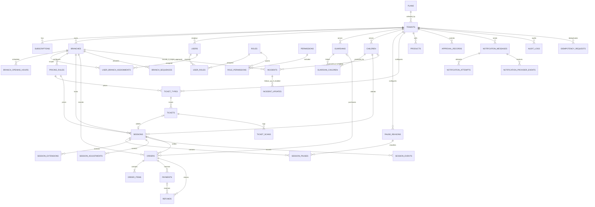

# PlayNexus Database ERD and Schema Specification

## 2026-09-15 actual-schema boundary

The migrations are the authority for the implemented schema: conventional bigint identifiers, explicit tenant/branch composite constraints, workflow-specific idempotency records, and implemented `plans`, `subscriptions`, and `subscription_billing_records`. Provider events remain target-only; Egypt MVP explicitly excludes pause.

## 2026-09-15 M6 notification implementation subset

Migration `2026_09_15_000023_create_operational_notifications` implements `notification_messages` and append-only `notification_attempts` with explicit tenant and optional branch/guardian/session/order scope, encrypted and masked destination, allowlisted purpose/template, dedupe identity, attempts/timestamps and truthful terminal state. Provider callback events remain unimplemented with external providers blocked by OQ-05/OQ-13; incident tables remain absent under OQ-20.

## 2026-09-13 check-in/session implementation subset

Migration `2026_09_13_000015_create_play_sessions` adds conventional bigint `play_sessions` and append-only `play_session_events`, while adding the composite ticket key needed for `(tenant_id,branch_id,ticket_id)` integrity. A session carries explicit tenant, branch, child, guardian, ticket, pricing rule, status, UTC start/expected/end times, immutable pricing snapshot, actor and lock version. Composite foreign keys prevent cross-tenant/cross-branch ticket, pricing, family or actor references; one tenant/ticket can create at most one session. Event rows carry transition, reason, actor, UTC occurrence, bounded metadata and request ID.

The application serializes accepted check-in through the tenant lock and treats Active rows as occupying child/capacity state. Paused rows are historical target material and cannot be created in the Egypt MVP. MySQL and SQLite cannot express the intended conditional uniqueness identically without a generated-column design, so the current safe MVP invariant is transactional and covered by a real InnoDB multi-process test. There is no authentication-table collision because the aggregate is named `play_sessions`. No pause/checkout/payment/receipt tables or commands are introduced by this subset.

The M3 live estimate adds no table or column: it reads `play_sessions.started_at` and `pricing_snapshot_json` at one server time and returns an in-memory view attribute only. Final checkout inputs/outputs must use their later immutable persistence contract rather than reusing this display estimate as financial evidence.

## 2026-09-13 ticket lifecycle implementation subset

Migration `2026_09_13_000014_create_ticketing_tables` adds conventional bigint ticket types, tickets, and append-only ticket scans. Types reference an immutable pricing version using `(tenant_id,branch_id,pricing_rule_id)`; tickets reference their type using `(tenant_id,branch_id,ticket_type_id)`. Guardians, children, actors, and scan branches have tenant-aware foreign keys. There is no update/delete route for types or scans. This implemented subset uses UTC DATETIME ticket validity/event fields and the existing timestamp conventions, not the proposed ULID/microsecond schema below.

Issued tickets capture a branch-local `service_date`, UTC half-open operating window `[valid_from,valid_until)`, integer EGP amount, full immutable pricing/tax/timezone snapshot, encrypted opaque QR payload, tenant-unique SHA-256 code hash, and separate manual display code. Issue/scan UUID keys are unique within tenant/actor and compared against canonical request fingerprints. Reassignment uses `lock_version`; first accepted validation sets permanent `assignment_locked_at`. Cancellation stores manager actor/time/reason and cannot bypass a successful scan/use. Session consumption fields are reserved denial guards, not evidence of a session or financial ledger. No payment/refund/session table is introduced by this migration.

## T18-T20 audit implementation subset

The first audit_logs migration records successful staff status/branch-assignment mutations: bigint id/tenant_id/actor_user_id, nullable branch_id, actor_type/action/subject_type/subject_id/outcome/reason_code, nullable JSON before_json/after_json, server-generated UUID request_id and UTC occurred_at. Composite actor/branch FKs enforce tenant scope; no updated_at or application update/delete route. Restrict deletion of referenced entities to preserve evidence. Generic denial/security audit, platform audit, network hashes and richer masking are not delivered by this subset. Expected-state checks reuse existing staff/pivot fields; no generic version framework is added.

## T14 bounded owner-read implementation

The initial owner-read slice uses `tenant_owners`: non-null bigint `tenant_id` and `user_id`, timestamps, primary key `(tenant_id,user_id)`, and composite FK to `users(tenant_id,id)` with cascade deletion. Ownership is explicitly provisioned; no existing branch role is promoted. The generic RBAC schema below remains the broader target, not a claim of implemented tables. See the 2026-09-12 decision in `.ai/DECISIONS.md`.

**Document ID:** PN-DATA-001  
**Status:** Draft proposed schema; migration freeze is blocked by the named open decisions  
**Database:** MySQL, current supported release at implementation start  
**Source:** PlayNexus PRD v1.0

## 1. Design rules

1. Use Laravel's conventional `id` primary key name with ULID values stored as `CHAR(26)` using an ASCII binary collation. Foreign keys retain the PRD names such as `tenant_id`, `branch_id`, `child_id`, and `session_id`.
2. Every tenant-owned table has a non-null `tenant_id`, an index beginning with `tenant_id`, and tenant-aware foreign keys.
3. Root/platform tables are `plans`, `tenants`, `roles`, `permissions`, and `role_permissions`. `users.tenant_id` is nullable only because platform Super Admin users are not tenant-owned.
4. Store operational timestamps in UTC as `DATETIME(6)`. Store each branch's IANA time-zone name for display and local-day reporting.
5. Store money as signed `BIGINT` minor units and currency as `CHAR(3)`. Store rates as integer basis points. Never use `FLOAT`/`DOUBLE` for money.
6. Use append-only rows for payments, refunds, ticket scans, session events, approval decisions, notification attempts, and audit logs.
7. Use `archived_at` for reference/master data that may be retired. Never soft-delete financial, safety, or audit history.
8. JSON columns hold bounded configuration or immutable calculation snapshots, not relationships that need querying or referential integrity.
9. Sensitive notes and notification destinations are encrypted by the application where specified. Logs and API responses mask them by role.
10. Every state-changing aggregate has `lock_version INT UNSIGNED NOT NULL DEFAULT 1` when optimistic concurrency is exposed to clients.

### 1.1 Standard columns

Unless a table explicitly says otherwise, add:

```text
id CHAR(26) PRIMARY KEY
created_at DATETIME(6) NOT NULL
updated_at DATETIME(6) NOT NULL
```

For every tenant-owned table, also add:

```text
tenant_id CHAR(26) NOT NULL
INDEX ix_<table>_tenant (tenant_id)
UNIQUE KEY uq_<table>_tenant_id (tenant_id, id)
FOREIGN KEY (tenant_id) REFERENCES tenants(id)
```

The apparently redundant `(tenant_id, id)` unique key enables composite foreign keys that prove parent and child rows belong to the same tenant.

## 2. Conceptual ERD



Games, queues, participation, cashier shifts/cash-drawer balancing, birthdays, membership, loyalty, wallet, inventory, HR, marketplace, online-payment, and incident-management tables are intentionally absent from the Egypt V1 schema. OQ-20 explicitly defers incidents; a later approved contract is required before any such migration, model, permission, or route ships.

## 3. Platform and access tables

### 3.1 `plans`

| Column | Type | Null/default | Constraints/notes |
|---|---|---|---|
| `id` | BIGINT UNSIGNED | no | PK |
| `code` | VARCHAR(50) | no | unique immutable code |
| `name` | VARCHAR(120) | no | display name |
| `description` | VARCHAR(500) | yes | editable description |
| `status` | VARCHAR(20) | `active` | application-restricted to `active`, `inactive` |
| `limits_json` | JSON | no | canonical `branches` and `users` quantitative limits |
| `features_json` | JSON | no | empty for OQ-04; feature gating is not approved |
| `monthly_price_minor`, `annual_price_minor` | BIGINT UNSIGNED | yes | EGP plan prices in minor units |
| `annual_discount_bps` | INT UNSIGNED | `0` | annual discount in basis points |
| `currency` | CHAR(3) | `EGP` | OQ-04 catalog currency |
| `lock_version` | INT UNSIGNED | `1` | optimistic concurrency |
| `created_at`, `updated_at` | DATETIME(6) | no | UTC |

Indexes: `UNIQUE(code)`, `INDEX(status)`.

### 3.2 `tenants`

| Column | Type | Null/default | Constraints/notes |
|---|---|---|---|
| `id` | CHAR(26) | no | PK |
| `current_subscription_id` | BIGINT UNSIGNED | yes | authoritative current subscription; composite FK with tenant id |
| `legal_name` | VARCHAR(190) | no | business name |
| `display_name` | VARCHAR(190) | no | UI name |
| `slug` | VARCHAR(100) | no | unique login/URL identifier |
| `status` | ENUM | `pending` | `pending`, `active`, `suspended`, `closed` |
| `billing_status` | VARCHAR(20) | `trial` | denormalized display value; never the access authority |
| `currency` | CHAR(3) | no | approved Egypt V1 accounting currency is EGP under OQ-06 |
| `locale` | VARCHAR(10) | `en` | e.g. `en`, `ar` |
| `settings_json` | JSON | no | approved tenant-wide operational settings |
| `activated_at` | DATETIME(6) | yes | UTC |
| `suspended_at` | DATETIME(6) | yes | UTC |
| `lock_version` | INT UNSIGNED | `1` | optimistic concurrency |
| `created_at`, `updated_at` | DATETIME(6) | no | UTC |

Indexes: `UNIQUE(slug)`, `INDEX(plan_id,status)`, `INDEX(billing_status)`.

### 3.3 `subscriptions`

Tenant-owned historical rows. Important columns are `tenant_id`, `plan_id`, approved lifecycle `status`, `billing_interval`, immutable `price_amount_minor`/`price_currency`/`price_annual_discount_bps` snapshots, `custom_limits_json`, optional `custom_limits_override_until`, mandatory override reason/actor fields, `starts_at`, trial/grace/current-period boundaries, cancellation facts, `lock_version`, and timestamps. `tenants.current_subscription_id` is the sole effective pointer and is protected by a composite `(tenant_id,id)` foreign key; plan changes append history rather than overwriting it.

### 3.3.1 `subscription_billing_records`

Manual PlayNexus SaaS billing only, separate from venue POS. Stores tenant/subscription, tenant-scoped unique reference, integer minor-unit amount, EGP currency, billing-period boundaries, payment timestamp/method, notes, recording actor, and timestamps. A composite tenant/subscription foreign key prevents cross-tenant invoice attachment.

### 3.4 `branches`

Tenant-owned.

| Column | Type | Null/default | Constraints/notes |
|---|---|---|---|
| `creation_key` | UUID | yes | tenant-scoped idempotency key for branch creation retries; null only for legacy rows |
| `code` | VARCHAR(30) | no | unique within tenant |
| `name` | VARCHAR(190) | no | branch name |
| `status` | ENUM | `active` | `active`, `inactive` |
| `timezone` | VARCHAR(64) | no | IANA zone, e.g. `Africa/Cairo` |
| `address_json` | JSON | yes | localized structured address |
| `capacity` | INT UNSIGNED | no | `> 0` |
| `currency` | CHAR(3) | no | one operating currency for the branch; equality with tenant reporting currency is unresolved under OQ-06 |
| `tax_rate_bps` | INT UNSIGNED | `0` | `0..10000` |
| `tax_mode` | ENUM | `exclusive` | `exclusive`, `inclusive` |
| `discount_approval_bps` | INT UNSIGNED | `0` | manager approval threshold |
| `settings_json` | JSON | no | receipt prefix, alert offsets, hardware flags |
| `lock_version` | INT UNSIGNED | `1` | optimistic concurrency |
| `archived_at` | DATETIME(6) | yes | no new operations after archive |

Constraints/indexes: `UNIQUE(tenant_id,creation_key)`, `UNIQUE(tenant_id,code)`, `INDEX(tenant_id,status)`, check capacity/rate ranges.

### 3.5 `branch_opening_hours`

Tenant-owned. Columns: `branch_id`, `weekday TINYINT UNSIGNED` (`1=Monday..7=Sunday`), `opens_at TIME NULL`, `closes_at TIME NULL`, `is_closed BOOLEAN DEFAULT FALSE`, standard timestamps. Composite FK `(tenant_id,branch_id)` → `branches(tenant_id,id)`. Constraint: exactly one row per `(tenant_id,branch_id,weekday)`; open/close are both null for a closed day and both present otherwise.

### 3.6 `users`

| Column | Type | Null/default | Constraints/notes |
|---|---|---|---|
| `id` | CHAR(26) | no | PK |
| `tenant_id` | CHAR(26) | yes | null only for `platform` identity |
| `user_type` | ENUM | `tenant` | `platform`, `tenant` |
| `name` | VARCHAR(190) | no | staff name |
| `email` | VARCHAR(190) | no | globally unique normalized login |
| `phone_e164` | VARCHAR(20) | yes | normalized |
| `password` | VARCHAR(255) | no | framework password hash |
| `status` | ENUM | `invited` | `invited`, `active`, `suspended`, `disabled` |
| `locale` | VARCHAR(10) | `en` | preferred UI locale |
| `email_verified_at` | DATETIME(6) | yes | UTC |
| `last_login_at` | DATETIME(6) | yes | UTC |
| `remember_token` | VARCHAR(100) | yes | Laravel web auth |
| `lock_version` | INT UNSIGNED | `1` | optimistic concurrency |
| `created_at`, `updated_at` | DATETIME(6) | no | UTC |

Constraints: `UNIQUE(email)`, `UNIQUE(tenant_id,id)`, FK `tenant_id`; check `(user_type='platform' AND tenant_id IS NULL) OR (user_type='tenant' AND tenant_id IS NOT NULL)`. Indexes: `(tenant_id,status)`, `(tenant_id,phone_e164)`.

### 3.7 RBAC tables

`roles`: `id`, `code VARCHAR(80) UNIQUE`, `name VARCHAR(120)`, `scope ENUM('platform','tenant','branch','customer')`, `is_system BOOLEAN`, timestamps. Seed exactly the roles in the permission matrix. Custom roles are deferred; Tenant Owner role management means assigning/revoking approved roles in MVP.

`permissions`: `id`, `code VARCHAR(120) UNIQUE`, `description VARCHAR(255)`, `risk ENUM('standard','sensitive','high')`, timestamps.

`role_permissions`: `role_id`, `permission_id`; composite PK and FKs. No timestamps required.

`user_roles`: tenant-owned; `user_id`, `role_id`, `assigned_by_user_id`, `assigned_at`. Unique `(tenant_id,user_id,role_id)`; composite FKs to tenant user and assigning user; ordinary tenant users may receive only tenant/branch roles.

`user_branch_assignments`: tenant-owned; `user_id`, `branch_id`, `assigned_by_user_id`, `status ENUM('active','inactive')`, timestamps. Unique `(tenant_id,user_id,branch_id)`; composite tenant-aware FKs. Tenant Owner can operate tenant-wide without one row, while all branch roles require at least one active assignment.

Framework auth tables: Laravel password-reset tokens, web sessions, and Sanctum personal-access tokens use their standard schemas. API tokens are tied to a user, store hashed tokens and abilities, and have an expiry. Revoking/suspending a user invalidates all active sessions/tokens.

## 4. Customer registry

**M2 implementation amendment — 2026-09-13:** migrations implement `guardians`, `children`, `guardian_child`, and append-only `family_consent_events` with explicit tenant/actor scope, tenant-aware foreign keys, tenant-unique normalized guardian phone, optional DOB, required-on-new-active-child emergency fallback, encrypted optional safety notes, and checkout/primary/verification/revocation relationship evidence. Retention execution and any additional lifecycle timestamps wait for M3 session/last-visit data under the approved dependency waiver. Child photos and automatic merge remain deferred.

### 4.1 `guardians`

Tenant-owned.

| Column | Type | Null/default | Notes |
|---|---|---|---|
| `full_name` | VARCHAR(190) | no | searchable display name |
| `phone_e164` | VARCHAR(20) | no | primary duplicate-detection key |
| `secondary_phone_e164` | VARCHAR(20) | yes | optional |
| `email` | VARCHAR(190) | yes | normalized |
| `preferred_locale` | VARCHAR(10) | `ar` | `ar` or `en` initially |
| `operational_consent_at` | DATETIME(6) | yes | service communications acknowledgement |
| `marketing_consent_at` | DATETIME(6) | yes | null means no consent |
| `marketing_opted_out_at` | DATETIME(6) | yes | opt-out wins |
| `status` | ENUM | `active` | `active`, `blocked`, `anonymized` |
| `notes_encrypted` | LONGTEXT | yes | application-encrypted general notes |
| `created_by_user_id` | CHAR(26) | no | tenant-aware FK → users |
| `updated_by_user_id` | CHAR(26) | no | tenant-aware FK → users |
| `lock_version` | INT UNSIGNED | `1` | concurrency |
| `archived_at` | DATETIME(6) | yes | no hard delete |

Approved indexes: `UNIQUE(tenant_id,phone_e164)`, `INDEX(tenant_id,full_name)`, and `INDEX(tenant_id,email)`. OQ-17 is closed: a current-tenant match reuses the existing family; there is no create-anyway or automatic merge in MVP.

### 4.2 `children`

Tenant-owned. Approved M2 columns: `full_name VARCHAR(190)`, optional `date_of_birth DATE`, required-for-active `emergency_contact_name VARCHAR(190)` and `emergency_contact_phone_e164 VARCHAR(20)`, optional application-encrypted `safety_notes_encrypted TEXT`, `status ENUM('active','restricted','anonymized')`, actor IDs, `lock_version`, `archived_at`, and timestamps. Child photo and gender are deferred. If DOB exists, age is derived for the requested local date and never redundantly stored.

### 4.3 `guardian_children` (planned full model; first slice uses `guardian_child`)

Tenant-owned. Columns: `guardian_id`, `child_id`, `relationship ENUM('mother','father','legal_guardian','authorized_pickup','other')`, `can_consent BOOLEAN`, `can_check_out BOOLEAN`, `is_primary BOOLEAN`, verification actor/time/method, status, revocation actor/time, and timestamps. PK/unique `(tenant_id,guardian_id,child_id)` and tenant-aware FKs. Only mother/father/legal guardian may have `can_consent=TRUE`. A child must retain at least one active, verified, checkout-capable legal guardian; revocation/reactivation enforces this invariant transactionally. OQ-12 defines the later checkout evidence method.

### 4.4 `family_consent_events`

Append-only tenant-owned evidence: `guardian_id`, `child_id`, `consent_type` (`child_data`, `marketing`), `status` (`granted`, `withdrawn`), `notice_version`, purpose/data-category snapshot, `locale`, `method`, staff actor, optional branch, request ID, and `occurred_at` UTC. No mutable consent Boolean is authoritative. Child-data consent must reference an active consent-capable relationship; marketing refusal never blocks service.

## 5. Pricing, tickets, and sessions

### 5.1 `pricing_rules`

**Implemented first slice — 2026-09-12:** migration `000011` creates immutable branch rules with explicit tenant/branch/actor scope, composite tenant-aware foreign keys, unique `(tenant_id,branch_id,code,version)`, integer minor-unit prices, fixed-duration mode, 600-second grace, 1,800-second overtime unit, EGP, branch tax snapshot, active status, and version 1. Effective dates, retirement/cloning, per-unit modes, sessions, and calculation snapshots remain later work.

Tenant-owned. Columns:

- `branch_id CHAR(26) NULL`: null is a tenant default; non-null is branch-specific.
- `code VARCHAR(50)`, `name VARCHAR(190)`, `version SMALLINT UNSIGNED`.
- `billing_mode ENUM('fixed_duration','per_unit')`.
- `base_duration_seconds INT UNSIGNED`, `base_price_minor BIGINT`.
- `overtime_unit_seconds INT UNSIGNED`, `overtime_price_minor BIGINT`.
- `overtime_rounding ENUM('ceil_unit','prorate') DEFAULT 'ceil_unit'`.
- `grace_period_seconds INT UNSIGNED DEFAULT 0`.
- `pause_billing_mode ENUM('exclude_eligible','include_all') DEFAULT 'exclude_eligible'`.
- `currency CHAR(3)`, `tax_rate_bps INT UNSIGNED`, `tax_mode ENUM('exclusive','inclusive')`.
- `effective_from DATETIME(6)`, `effective_to DATETIME(6) NULL`, `status ENUM('draft','active','retired')`.
- `created_by_user_id`, timestamps; no in-place update after first use.

Unique/indexes: `UNIQUE(tenant_id,branch_id,code,version)`, `(tenant_id,branch_id,status,effective_from)`. Check non-negative money/duration and rate ranges. A published rule is retired and cloned for changes so sessions retain reproducible snapshots.

### 5.2 `pause_reasons`

Tenant-owned. Columns: `code VARCHAR(50)`, `name VARCHAR(120)`, `excludes_billing BOOLEAN`, `requires_manager BOOLEAN`, `max_seconds INT UNSIGNED NULL`, `status ENUM('active','inactive')`, timestamps. Unique `(tenant_id,code)`.

### 5.3 `ticket_types`

Tenant-owned. Columns: `branch_id NULL`, `pricing_rule_id`, `code VARCHAR(50)`, `name VARCHAR(190)`, `kind ENUM('standard','family','seasonal','party','promotional')`, `price_minor BIGINT`, `currency CHAR(3)`, `valid_for_seconds INT UNSIGNED NULL`, `valid_from DATETIME(6) NULL`, `valid_until DATETIME(6) NULL`, `max_uses SMALLINT UNSIGNED DEFAULT 1`, `status ENUM('active','inactive')`, `archived_at`, timestamps. Tenant-aware FKs; unique `(tenant_id,branch_id,code)`; indexes `(tenant_id,status)`, `(tenant_id,pricing_rule_id)`.

### 5.4 `tickets`

Tenant-owned. Columns: `branch_id`, `service_date DATE`, `ticket_type_id`, `guardian_id NULL`, `child_id NULL`, `order_item_id NULL`, `status ENUM('issued','consumed','cancelled','expired')`, `code_hash CHAR(64)`, `code_payload_encrypted TEXT`, `display_code VARCHAR(20)`, `issued_at`, `valid_from`, `valid_until`, `assignment_locked_at NULL`, `consumed_at NULL`, `cancelled_at NULL`, `cancelled_by_user_id NULL`, `cancellation_reason VARCHAR(500) NULL`, `uses_count SMALLINT UNSIGNED DEFAULT 0`, `max_uses SMALLINT UNSIGNED`, `price_snapshot_json JSON`, `issued_by_user_id`, `lock_version`, timestamps. Unique `(tenant_id,code_hash)`, `(tenant_id,display_code)`; indexes `(tenant_id,branch_id,service_date,status)`, `(tenant_id,branch_id,status,valid_until)`, `(tenant_id,child_id)`. `service_date` is interpreted in the immutable ticket branch time-zone/operating-window snapshot. A ticket payload is treated as a bearer secret and never logged. Issuance creates `issued` directly; reprint is an audit event and does not change state or payload.

Before `assignment_locked_at`, authorized staff may correct an unused ticket's guardian/child binding with expected-version and audit evidence. The first accepted scan sets `assignment_locked_at`; binding is immutable afterward. Refund eligibility requires `status=issued`, no accepted scan/lock, no consumption, and no linked session, plus an action-bound Branch Manager/Tenant Owner approval. The later OQ-09 financial workflow appends any paid reversal and never rewrites the ticket/payment.

### 5.5 `ticket_scans`

Tenant-owned and append-only. Columns: `ticket_id NULL` (unknown codes still produce a scan row with no ticket), `branch_id`, `scanned_by_user_id`, `scanned_at`, `scan_purpose ENUM('validate','check_in','reentry')`, `result ENUM('accepted','not_found','expired','cancelled','already_consumed','wrong_branch','wrong_service_date','policy_denied')`, `code_hash CHAR(64)`, `device_label VARCHAR(120) NULL`, `reason_code VARCHAR(80) NULL`, `request_id CHAR(36)`. Indexes `(tenant_id,ticket_id,scanned_at)`, `(tenant_id,branch_id,scanned_at)`, `(tenant_id,result,scanned_at)`.

### 5.6 `sessions`

Tenant-owned.

| Column | Type | Null/default | Notes |
|---|---|---|---|
| `branch_id` | CHAR(26) | no | tenant-aware FK |
| `child_id` | CHAR(26) | no | tenant-aware FK |
| `ticket_id` | CHAR(26) | yes | one-to-one when used; unique `(tenant_id,ticket_id)` |
| `pricing_rule_id` | CHAR(26) | no | source rule |
| `status` | ENUM | `active` | `active`, `pending_payment`, `completed`, `cancelled` (paused is historical target only) |
| `started_at` | DATETIME(6) | no | server UTC |
| `expected_end_at` | DATETIME(6) | yes | for operational alerting only |
| `ended_at` | DATETIME(6) | yes | set on completed/cancelled |
| `pricing_snapshot_json` | JSON | no | immutable pricing inputs |
| `elapsed_seconds` | INT UNSIGNED | `0` | checkout snapshot |
| `excluded_pause_seconds` | INT UNSIGNED | `0` | checkout snapshot |
| `billable_seconds` | INT UNSIGNED | `0` | checkout snapshot |
| `subtotal_minor` | BIGINT | `0` | checkout snapshot |
| `tax_minor` | BIGINT | `0` | checkout snapshot |
| `adjustment_minor` | BIGINT | `0` | approved total adjustment |
| `total_minor` | BIGINT | `0` | final session charge |
| `currency` | CHAR(3) | no | snapshot |
| `checkout_guardian_id` | CHAR(26) | yes | matched guardian |
| `checkout_verified_by_user_id` | CHAR(26) | yes | staff actor |
| `checkout_verification_method` | VARCHAR(50) | yes | allowlisted code selected only after OQ-12; not a frozen enum |
| `checkout_approval_record_id` | CHAR(26) | yes | required for override |
| `order_id` | CHAR(26) | yes | settlement order; FK added late |
| `created_by_user_id` | CHAR(26) | no | check-in actor |
| `cancelled_by_user_id` | CHAR(26) | yes | authorized actor |
| `cancellation_reason` | VARCHAR(500) | yes | required when cancelled |
| `lock_version` | INT UNSIGNED | `1` | increment every transition |
| standard timestamps | DATETIME(6) | no | UTC |

Indexes: `(tenant_id,branch_id,status,started_at)`, `(tenant_id,child_id,status)`, `(tenant_id,status,expected_end_at)`, `(tenant_id,started_at)`, unique ticket and order links. Check end/state consistency. Duplicate active sessions are prevented by locking the child row and checking active sessions in the same transaction; no alternate write path may bypass the session action.

### 5.7 `session_pauses`

Tenant-owned. Columns: `session_id`, `pause_reason_id`, `started_at`, `ended_at NULL`, `duration_seconds INT UNSIGNED NULL`, `excludes_billing BOOLEAN` (snapshot), `reason_note VARCHAR(500) NULL`, `started_by_user_id`, `ended_by_user_id NULL`, `approval_record_id NULL`, timestamps. Indexes `(tenant_id,session_id,started_at)`, `(tenant_id,session_id,ended_at)`. An application transaction under session row lock guarantees at most one row with `ended_at IS NULL`.

### 5.8 `session_extensions`

Tenant-owned and append-only. Columns: `session_id`, `extension_code VARCHAR(80)`, `added_seconds INT UNSIGNED`, `subtotal_minor BIGINT`, `tax_minor BIGINT`, `total_minor BIGINT`, `currency CHAR(3)`, `pricing_snapshot_json JSON`, `applied_by_user_id`, `approval_record_id NULL`, `applied_at`, `idempotency_key VARCHAR(100)`, timestamps. Unique `(tenant_id,idempotency_key)`; index `(tenant_id,session_id,applied_at)`. Configured options use server-held values; an approved manual extension records the exact requested/approved value without editing source timestamps.

### 5.9 `session_adjustments`

Tenant-owned and append-only. Columns: `session_id`, `kind ENUM('time_add','time_remove','charge_add','charge_remove')`, `seconds_delta INT NULL`, `amount_minor BIGINT NULL`, `currency CHAR(3) NULL`, `reason VARCHAR(500)`, `requested_by_user_id`, `approval_record_id`, `applied_by_user_id`, `applied_at`, timestamps. Check that exactly the columns for the selected kind are populated. Index `(tenant_id,session_id,applied_at)`.

### 5.10 `session_events`

Tenant-owned and append-only. Columns: `session_id`, `event_type ENUM('checked_in','paused','resumed','extended','checked_out','cancelled','adjusted','alert_queued','alert_staled')`, `from_status ENUM NULL`, `to_status ENUM NULL`, `actor_user_id NULL`, `occurred_at`, `metadata_json JSON`, `request_id CHAR(36)`. Indexes `(tenant_id,session_id,occurred_at)`, `(tenant_id,event_type,occurred_at)`.

## 6. POS and finance

### 6.1 `products`

Tenant-owned. Columns: `branch_id NULL` (null means all branches), `sku VARCHAR(80)`, `name VARCHAR(190)`, `type ENUM('food_beverage','merchandise','add_on','extension')`, `price_minor BIGINT`, `currency CHAR(3)`, `tax_rate_bps INT UNSIGNED`, `tax_mode ENUM('exclusive','inclusive')`, `status ENUM('active','inactive')`, `archived_at`, timestamps. Unique `(tenant_id,branch_id,sku)`; indexes `(tenant_id,status,type)`, `(tenant_id,branch_id,status)`.

### 6.2 `orders`

Tenant-owned. Columns: `branch_id`, `guardian_id NULL`, `session_id NULL`, `receipt_number VARCHAR(50) NULL`, `status ENUM('draft','paid','refunded','voided')`, `subtotal_minor`, `discount_minor`, `tax_minor`, `total_minor`, `paid_minor`, `refunded_minor`, `currency`, `discount_reason NULL`, `discount_approval_record_id NULL`, `opened_by_user_id`, `paid_by_user_id NULL`, `paid_at NULL`, `voided_by_user_id NULL`, `void_reason NULL`, `lock_version`, timestamps. Unique `(tenant_id,branch_id,receipt_number)`, `(tenant_id,session_id)` when session is non-null; indexes `(tenant_id,branch_id,status,created_at)`, `(tenant_id,guardian_id,created_at)`, `(tenant_id,paid_at)`. MVP checks require `paid_minor` and `refunded_minor` each to be either zero or `total_minor`; partial values are invalid.

### 6.3 `order_items`

Tenant-owned. Columns: `order_id`, `line_number SMALLINT UNSIGNED`, `item_kind ENUM('product','ticket','session','manual_add_on')`, `product_id NULL`, `ticket_type_id NULL`, `session_id NULL`, `description_snapshot VARCHAR(255)`, `quantity INT UNSIGNED`, `unit_price_minor BIGINT`, `discount_minor BIGINT`, `tax_rate_bps`, `tax_minor BIGINT`, `line_total_minor BIGINT`, `currency CHAR(3)`, `metadata_json JSON`, timestamps. Unique `(tenant_id,order_id,line_number)`; indexes on each nullable source FK. Check quantity > 0 and exactly one source FK for product/ticket/session kinds; manual add-on has no source FK and requires permission.

### 6.4 `payments`

Tenant-owned and append-only. Columns: `order_id`, `method ENUM('cash','card_terminal','bank_transfer','other')`, `status ENUM('posted','voided')`, `amount_minor BIGINT`, `currency CHAR(3)`, `external_reference VARCHAR(190) NULL`, `posted_by_user_id`, `posted_at`, `voided_by_user_id NULL`, `voided_at NULL`, `void_reason NULL`, `idempotency_key VARCHAR(100)`, timestamps. Unique `(tenant_id,order_id)` and `(tenant_id,idempotency_key)`; indexes `(tenant_id,posted_at)`, `(tenant_id,external_reference)`. Posting requires `amount_minor = order.total_minor`, matching currency, and a draft order; split/partial payments are rejected. A void is an explicit audited correction and settled history is not deleted.

### 6.5 `refunds`

The approved cash pilot uses one tenant/branch-owned request record with `order_id`, `payment_id`, `requested_by_user_id`, `approved_by_user_id NULL`, `executed_by_user_id NULL`, `amount_minor`, `currency`, `reason`, `expected_order_lock_version`, request/execution idempotency keys and fingerprints, and requested/approved/executed UTC timestamps. State is `requested → approved → refunded`. Approval and execution are distinct; requester cannot approve. Executed financial facts are immutable. Unique `(tenant_id,order_id)` and tenant-scoped request/execution keys prevent duplicate reversal. Composite payment linkage must bind tenant, branch, order and payment together. The server derives full amount/currency from the original posted cash payment; execution requires the original branch and same branch-local date, no prior refund, and `amount_minor = payment.amount_minor = order.paid_minor = order.total_minor`. Every linked ticket must be unused with no accepted scan or session; execution invalidates refunded tickets atomically. Original receipt commercial snapshots are retained, with current refund state returned separately. Partial refunds and a generic shared approval framework are outside this pilot.

### 6.6 `branch_sequences`

Tenant-owned. Columns: `branch_id`, `sequence_name VARCHAR(50)`, `current_value BIGINT UNSIGNED`, `prefix VARCHAR(20)`, `lock_version`, timestamps. Unique `(tenant_id,branch_id,sequence_name)`. Allocate receipt numbers by locking this row in the payment transaction.

## 7. Approvals, notifications, audit, and idempotency

### 7.1 `approval_records`

The bounded pilot table holds discount approvals only: explicit tenant/branch/order references, requester/approver/rejecter/consumer references, fixed `discount_minor`, currency, reason/rejection reason, server-derived reviewable `request_payload_json`, payload fingerprint, expected order lock version, ten-minute expiry and decision/consumption timestamps. State is `requested → approved/rejected`, and approved records can be consumed once inside the payment transaction. Expired or changed-cart requests fail closed. The requester cannot approve their own request; there is no emergency self-approval exception in this pilot. The fingerprint binds the locked persisted server-priced lines, totals, currency, exact discount and version, not arbitrary client JSON. Empty-line drafts are ineligible. Discount allocation preserves unit prices and reconciles line totals with the discounted order. Refund decisions stay in their dedicated request table; other sensitive session/ticket commands retain their existing audited domain contracts rather than introducing a speculative generic approval framework.

### 7.2 `notification_messages`

Tenant-owned. Columns: `branch_id NULL`, `guardian_id NULL`, `session_id NULL`, `order_id NULL`, `channel ENUM('email','sms','whatsapp')`, `purpose ENUM('session_ending','receipt')`, `template_key VARCHAR(100)`, `template_version VARCHAR(40)`, `locale VARCHAR(10)`, `destination_encrypted TEXT`, `destination_masked VARCHAR(100)`, `payload_json JSON`, `status ENUM('queued','sending','sent','delivered','failed_retryable','failed_permanent','stale')`, `dedupe_key VARCHAR(190)`, `scheduled_at`, `sent_at NULL`, `delivered_at NULL`, `failed_at NULL`, `stale_at NULL`, `provider_message_id NULL`, `attempt_count SMALLINT UNSIGNED DEFAULT 0`, `lock_version INT UNSIGNED DEFAULT 1`, timestamps. Unique `(tenant_id,dedupe_key)`; indexes `(tenant_id,status,scheduled_at)`, `(tenant_id,guardian_id,created_at)`, `(tenant_id,session_id)`, `(tenant_id,provider_message_id)`. MVP seeds only allowlisted session-ending and receipt templates. Marketing purpose/templates/permission are future and absent from MVP migrations/seeds/API.

### 7.3 `notification_attempts`

Tenant-owned and append-only. Columns: `notification_message_id`, `attempt_number SMALLINT UNSIGNED`, `provider VARCHAR(80)`, `started_at`, `finished_at NULL`, `outcome ENUM('sent','failed_retryable','failed_permanent')`, `provider_status_code VARCHAR(80) NULL`, `provider_message_id NULL`, `error_code NULL`, `error_summary_masked VARCHAR(500) NULL`. Unique `(tenant_id,notification_message_id,attempt_number)`; index `(tenant_id,outcome,started_at)`.

### 7.4 `notification_provider_events`

Tenant-owned and append-only. Columns: `notification_message_id NULL`, `provider VARCHAR(80)`, `provider_event_id VARCHAR(190)`, `provider_message_id VARCHAR(190)`, `event_type VARCHAR(80)`, `event_occurred_at DATETIME(6)`, `received_at DATETIME(6)`, `signature_valid BOOLEAN`, `payload_hash CHAR(64)`, `processing_result ENUM('applied','duplicate','ignored_out_of_order','not_found','invalid')`, `request_id CHAR(36)`. Unique `(tenant_id,provider,provider_event_id)`; indexes `(tenant_id,provider_message_id,event_occurred_at)`, `(tenant_id,received_at)`. Only authenticated callbacks create rows; duplicates and out-of-order events cannot regress `delivered` to `sent` or a terminal failure.

### 7.5 `audit_logs`

Tenant-owned for tenant activity; platform activity uses a separate `platform_audit_logs` table with the same shape and no tenant/customer data. Columns: `branch_id NULL`, `actor_user_id NULL`, `actor_type ENUM('user','token','system','support')`, `action VARCHAR(120)`, `subject_type VARCHAR(80)`, `subject_id CHAR(26) NULL`, `outcome ENUM('success','denied','failed')`, `reason_code VARCHAR(80) NULL`, `reason_text_masked VARCHAR(500) NULL`, `before_json JSON NULL`, `after_json JSON NULL`, `request_id CHAR(36)`, `ip_hash CHAR(64) NULL`, `user_agent_hash CHAR(64) NULL`, `occurred_at DATETIME(6)`. No `updated_at` and no application update/delete method. Indexes `(tenant_id,occurred_at)`, `(tenant_id,branch_id,occurred_at)`, `(tenant_id,actor_user_id,occurred_at)`, `(tenant_id,subject_type,subject_id,occurred_at)`, `(tenant_id,action,occurred_at)`.

`platform_audit_logs`: `id`, `actor_user_id`, `action`, `target_tenant_id NULL`, `subject_type`, `subject_id`, `outcome`, masked reason/snapshots, request/network hashes, `occurred_at`. It is append-only and visible only to authorized platform auditors.

### 7.6 `idempotency_requests`

Tenant-owned. Columns: `actor_user_id`, `route_fingerprint VARCHAR(190)`, `idempotency_key VARCHAR(100)`, `request_hash CHAR(64)`, `state ENUM('processing','completed','failed')`, `response_status SMALLINT UNSIGNED NULL`, `response_headers_json JSON NULL`, `response_body_json JSON NULL`, `locked_until DATETIME(6)`, `expires_at DATETIME(6)`, `created_at`, `updated_at`. Unique `(tenant_id,actor_user_id,route_fingerprint,idempotency_key)`; index `(tenant_id,expires_at)`. Never store secrets or unmasked payment data in cached responses.

## 8. Basic incidents — deferred by OQ-20

Games, game queues, participation, and game capacity are future scope. Their tables are not part of this migration plan.

### 8.1 `incidents`

This table is a historical proposed design, not an approved Egypt V1 migration. OQ-20 defers the module; any reopening requires a newly approved incident contract before these fields may be treated as authoritative: `branch_id`, `child_id NULL`, `session_id NULL`, `category_code VARCHAR(80)`, `severity ENUM('low','medium','high','critical')`, `status ENUM('open','under_review','closed')`, `title VARCHAR(190)`, `description_encrypted LONGTEXT`, `reported_by_user_id`, `assigned_to_user_id NULL`, `occurred_at`, `closed_at NULL`, `lock_version`, timestamps. Historical proposed indexes were `(tenant_id,branch_id,status,occurred_at)`, `(tenant_id,child_id,occurred_at)`, `(tenant_id,reported_by_user_id,occurred_at)`, `(tenant_id,severity,status)`.

### 8.2 `incident_updates`

Deferred by OQ-20. The historical proposal was tenant-owned and append-only with columns: `incident_id`, `from_status ENUM('open','under_review','closed')`, `to_status ENUM('open','under_review','closed')`, `note_encrypted LONGTEXT`, `created_by_user_id`, `occurred_at`, `request_id CHAR(36)`. It is not an active Egypt V1 contract.

## 9. Canonical enums and transitions

Application enums must mirror database values exactly. Do not accept arbitrary state strings.

The order/payment/refund values below implement the approved OQ-09 cash-only, one-full-refund baseline. Split/partial behavior remains deferred and requires a later synchronized aggregate, API, receipt, report and test change.

| Aggregate | Values | Allowed transitions |
|---|---|---|
| Tenant | `pending`, `active`, `suspended`, `closed` | pending→active/suspended; active→suspended/closed; suspended→active/closed |
| Branch | `active`, `inactive` | either direction; inactive blocks new operational records |
| User | `invited`, `active`, `suspended`, `disabled` | invited→active/disabled; active↔suspended; any→disabled |
| Session | `active`, `pending_payment`, `completed`, `cancelled` | active?pending_payment?completed; active?cancelled (paused is historical target only) |
| Ticket | `issued`, `consumed`, `cancelled`, `expired` | issued→consumed/cancelled/expired |
| Order | `draft`, `paid`, `refunded`, `voided` | draft→paid/voided; paid→refunded |
| Payment | `posted`, `voided` | append as posted; posted→voided only through authorized correction |
| Refund | `posted` | append once for the full posted payment; no partial/refund state machine |
| Approval | `pending`, `approved`, `rejected`, `expired`, `consumed` | pending→approved/rejected/expired; approved→consumed/expired |
| Notification | `queued`, `sending`, `sent`, `delivered`, `failed_retryable`, `failed_permanent`, `stale` | queued→sending/stale; sending→sent/failed_retryable/failed_permanent/stale; failed_retryable→queued/failed_permanent/stale; sent→delivered; terminal states never regress |
| Incident | N/A in Egypt V1 | OQ-20 defers the module; historical proposed codes are not an active contract |

Use state transition actions, not generic model update endpoints.

## 10. Tenant isolation and referential integrity

### 10.1 Composite foreign-key pattern

For a tenant child reference, use:

```sql
FOREIGN KEY (tenant_id, child_id)
  REFERENCES children (tenant_id, id)
```

Apply the same pattern to branch, user, guardian, session, ticket, order, payment, and other tenant relationships. A global ULID prevents accidental collisions; the composite FK prevents a valid ID from another tenant being attached.

### 10.2 Required application controls

- Never mass-assign `tenant_id` from input.
- Create through tenant-scoped relationships or actions that set server context.
- Tenant-global models reject access when no context is present, including queues and scheduled commands.
- Platform queries use separate repositories and authorization; they do not disable tenant scopes in controllers.
- Cross-tenant lookup returns not found.
- Bulk updates/deletes must include `tenant_id` and pass a policy before execution.
- Raw SQL requires a code-review checklist entry proving tenant and branch predicates.

### 10.3 Branch scope

Branch-scoped users can access only active assigned branches. Historical records remain readable after branch deactivation if the role permits reports/audit; deactivation blocks new sessions, orders, tickets, and incidents.

## 11. Money, tax, and time conventions

### 11.1 Money

- `*_minor BIGINT`: smallest currency unit. Example: EGP 125.50 → `12550`.
- `currency CHAR(3)`: uppercase ISO 4217 code.
- Negative values are allowed only where the field explicitly represents a delta.
- Order and session totals are server-calculated and snapshotted.
- Payment/refund currency must equal order currency in MVP.
- No exchange-rate or multi-currency ledger is included.

### 11.2 Tax and discount

- `*_bps INT`: 100 basis points = 1%; values range `0..10000`.
- Tax mode and rate are copied to line/session snapshots.
- Discounts never alter unit price; store discount separately for reconciliation.
- Discounts over branch threshold require a bound consumed approval record.

### 11.3 Time

- API timestamps are RFC 3339 UTC (`Z`); MySQL stores UTC `DATETIME(6)`.
- Durations are integer seconds.
- Branch-local date filters are converted to half-open UTC ranges `[start, end)` using the stored IANA time zone.
- Timers use database/server timestamps, never the browser clock.
- Daylight-saving transitions are handled by time-zone conversion, not fixed offsets.

## 12. Retention, deletion, and anonymization

| Data | Baseline | Treatment |
|---|---|---|
| Audit logs | 730 days, pending legal approval | append-only; configurable upward; purge in bounded jobs |
| Idempotency responses | 24 hours unless a longer command-specific window is set | purge after `expires_at` |
| Web sessions/API token activity | security policy duration | revoke immediately on user disable |
| Notification attempt payloads | 180 days proposed | keep masked metadata; remove encrypted destination when no longer needed |
| Financial records | jurisdiction-dependent, unresolved | no generic purge; legal decision required |
| Incidents/safety records | jurisdiction-dependent, unresolved | restricted and never removed by generic customer cleanup |
| Child photos | while operationally needed | private storage; delete/anonymize only after retention/legal checks |

Customer deletion is an anonymization workflow: block new use, revoke consent, remove direct contact/photo data when legally permitted, preserve non-identifying financial/session aggregates and mandatory safety/audit records. The job must log counts and a decision reference without copying the erased PII.

## 13. Index strategy by critical query

| Query | Required leading index |
|---|---|
| Guardian search by phone | `guardians(tenant_id, phone_e164)` |
| Child search by name | `children(tenant_id, full_name)` |
| Active sessions board | `sessions(tenant_id, branch_id, status, started_at)` |
| Ending-alert scan | `sessions(tenant_id, status, expected_end_at)` |
| Child session history | `sessions(tenant_id, child_id, started_at)`; add this exact descending index in migration |
| Ticket scan lookup | `tickets(tenant_id, code_hash)` unique |
| Daily branch revenue | `orders(tenant_id, branch_id, completed_at)` plus payment/refund order indexes |
| Attendance | `sessions(tenant_id, branch_id, started_at)` |
| Staff activity | `audit_logs(tenant_id, actor_user_id, occurred_at)` |
| Incident search | `incidents(tenant_id, branch_id, status, occurred_at)` |

Use `EXPLAIN` with pilot-shaped data before adding duplicate indexes. Index foreign keys required by MySQL, but avoid indexing encrypted/unsearchable text.

## 14. Migration order

Migrations must be small and reversible until data-bearing destructive changes. Recommended order:

1. `plans`, `tenants`, `subscriptions`.
2. `branches`, `branch_opening_hours`, `branch_sequences`.
3. `users` and Laravel auth/session/token tables.
4. `roles`, `permissions`, `role_permissions`, `user_roles`, `user_branch_assignments`.
5. `guardians`, `children`, `guardian_children`.
6. `pricing_rules`, `pause_reasons`, `ticket_types`.
7. `products`.
8. `approval_records` without optional subject foreign keys (polymorphic audit reference).
9. `tickets` without `order_item_id` FK.
10. `sessions` without `order_id` FK; then `session_pauses`, `session_extensions`, `session_adjustments`, `session_events`, `ticket_scans`.
11. `orders`, `order_items`, `payments`, `refunds`.
12. Add deferred cycle FKs: `tickets.order_item_id`, `sessions.order_id`; add order/session unique links.
13. Only after a later decision reopens and approves incident scope: `incidents`, `incident_updates`.
14. `notification_messages`, `notification_attempts`, `notification_provider_events`.
15. `audit_logs`, `platform_audit_logs`, `idempotency_requests`.
16. Framework `jobs`, `job_batches` if used, and `failed_jobs`.
17. Seed immutable roles, MVP permissions, role-permission mappings, allowlisted operational notification templates, and a controlled initial Super Admin. Do not seed games, shifts, marketing, parent self-service, or incident permissions unless their scope is approved.

OQ-06, OQ-08, OQ-09, OQ-12, OQ-15, OQ-17 and OQ-19 are decided. OQ-20 incident tables and OQ-24 cashier shifts remain deferred. Production privacy notice/licensing and Finance/Legal deployment sign-off remain operational gates.

For the first migration set, use fresh schema creation rather than a long series of rename/alter migrations. Once production contains data, all migration changes become forward-only operational changes with explicit rollback/roll-forward instructions.

## 15. Seed and fixture rules

- Seed role and permission codes deterministically; code is the stable contract, not database ID.
- Seed no real child, guardian, phone, email, or payment data.
- Demo tenants use unmistakably synthetic data.
- Pricing fixtures cover fixed duration, per-unit, overtime, grace, eligible/ineligible pauses, and tax modes.
- Every integration test creates at least two tenant fixtures and uses deliberately similar entity names to detect missing scopes.

## 16. Reconciliation invariants

The following must hold and receive automated database-backed tests:

```text
order.total_minor = sum(order_items.line_total_minor)
draft order has paid_minor = 0 and refunded_minor = 0
paid order has exactly one posted payment and paid_minor = total_minor
refunded order has exactly one posted full refund and refunded_minor = paid_minor = total_minor
refund amount/currency = linked payment amount/currency; partial values are impossible
session.total_minor = session.subtotal_minor + session.tax_minor + session.adjustment_minor
completed session has ended_at, checkout verifier, calculation snapshot, and order link
active or pending_payment session has ended_at IS NULL
cancelled session has ended_at, cancelled_by_user_id, and cancellation_reason
child has at least one active checkout-capable guardian relationship
every cross-tenant reference has matching tenant_id
```

Nightly reconciliation reports mismatches without mutating data. Repair requires an explicit, audited corrective action or migration.

## Approved MVP decision amendment — 2026-09-10

- Receipt records require a unique `(tenant_id, branch_id, display_number)` and retain voided rows with reason; display numbers use `BRANCH-YYYY-000001`.
- Checkout/session completion stores verification method, outcome, guardian reference or handoff-code reference, and override approval reference when used.
- Pricing rules store fixed-duration package, grace seconds (600), overtime unit seconds (1800), pause disabled for MVP, tax mode/rate, and immutable calculation snapshots.
